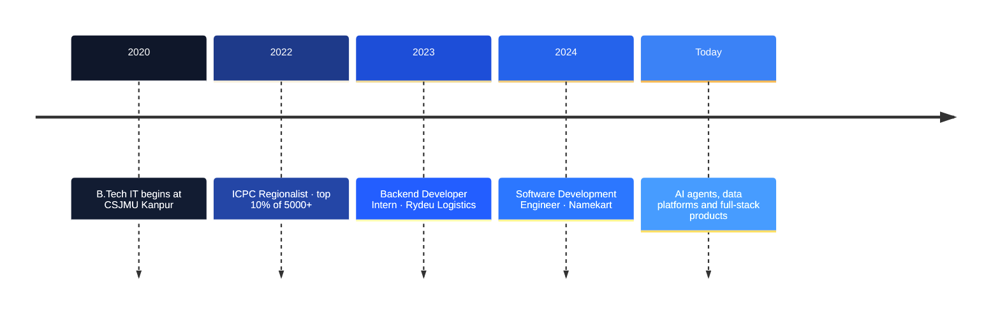

  

  

  
  
  
  
  

<table>
  <tr>
    <td align="center" width="20%"><h3>2+ yrs</h3>shipping production systems</td>
    <td align="center" width="20%"><h3>30+</h3>platform modules owned</td>
    <td align="center" width="20%"><h3>280K / day</h3>rows ingested into PostgreSQL</td>
    <td align="center" width="20%"><h3>15–30 ms</h3>filtered search on 4M rows</td>
    <td align="center" width="20%"><h3>800+</h3>DSA problems solved</td>
  </tr>
</table>

<h2 align="center">🧠 What I Build</h2>

<table>
  <tr>
    <td align="center" width="33%" valign="top"><h3>⚙️</h3><b>Backend & Microservices</b> Spring Boot and Node.js services, REST APIs, Kafka, WebSockets & SSE</td>
    <td align="center" width="33%" valign="top"><h3>🤖</h3><b>AI & Workflow Automation</b> Multi-agent services, Temporal workflows, LLM assistants with RAG</td>
    <td align="center" width="33%" valign="top"><h3>🗄️</h3><b>Data at Scale</b> Partitioned PostgreSQL, composite indexes, cursor pagination, streaming exports</td>
  </tr>
</table>
<table>
  <tr>
    <td align="center" width="33%" valign="top"><h3>🎨</h3><b>Modern Frontends</b> React and Next.js dashboards, real-time UIs, responsive design systems</td>
    <td align="center" width="33%" valign="top"><h3>🔐</h3><b>Auth & Security</b> Spring Security, Keycloak SSO, JWT / OAuth 2.0, role-based access control</td>
    <td align="center" width="33%" valign="top"><h3>☁️</h3><b>DevOps & Observability</b> Docker, GitHub Actions CI/CD, Prometheus, Grafana and Loki monitoring</td>
  </tr>
</table>

<h2 align="center">🛠️ Tech Stack</h2>

  
    
  

  
  
  
  
  
  
  

<h2 align="center">💼 Experience</h2>

### 🏢 Namekart · Software Development Engineer
Jul 2024 – Present · Noida · End-to-end owner of the domain-name platform across **30+ modules** (discovery, acquisition, pricing, sales)

<table>
  <tr>
    <td width="50%" valign="top">
      <b>🤖 AI SEO Automation Platform</b> 
      Multi-agent microservices orchestrated with <b>Temporal</b> for durable, auto-retried workflows. They run audits, keyword research, briefs and rank tracking, and deliver scheduled reports through a <b>Telegram bot</b>.
    </td>
    <td width="50%" valign="top">
      <b>💬 LLM-Powered AI Assistant</b> 
      Retrieval-augmented context with role-based access. Teams query platform data in plain English and get real-time reports, with <b>50% less manual analysis</b>.
    </td>
  </tr>
</table>
<table>
  <tr>
    <td width="50%" valign="top">
      <b>📈 Domain-Intelligence Service</b> 
      Spring Boot service ingesting <b>280K rows/day</b> into a partitioned <b>4M-row</b> PostgreSQL store, with <b>15–30 ms</b> filtered search and streaming CSV export.
    </td>
    <td width="50%" valign="top">
      <b>🧑‍💼 HR Portal</b> 
      Attendance, leave, work logs, automated stipends and location-based punch-ins across cities, with <b>70% less manual HR work</b>.
    </td>
  </tr>
</table>

### 🚚 Rydeu Logistics · Backend Developer Intern
Nov 2023 – Jun 2024 · Remote

<table align="center">
  <tr>
    <td align="center" width="25%"><h3>⚡ 40%</h3>faster critical APIs (2s → 1.2s)</td>
    <td align="center" width="25%"><h3>🔐 SSO</h3>Keycloak authentication & authorization</td>
    <td align="center" width="25%"><h3>🤖 −70%</h3>manual effort with automated vendor offers</td>
    <td align="center" width="25%"><h3>📈 +30%</h3>lead conversions via Freshworks CRM</td>
  </tr>
</table>

<h2 align="center">🚀 Featured Projects</h2>

<table>
  <tr>
    <td width="50%" valign="top">
      <h3>🎟️ <a href="https://github.com/sanjeev662/events-booking-system">Event Ticketing</a></h3>
      
Paid registrations for a live event: Razorpay checkout with signature verification, QR-coded PDF tickets and admin Excel export.

      

        
        
        
        
      

      
    </td>
    <td width="50%" valign="top">
      <h3>🤖 <a href="https://github.com/sanjeev662/job-scrapper">Job Scrapper Agent</a></h3>
      
Autonomous job discovery: a scheduled Playwright scraper with dedupe and daily caps, Gemini-ranked resume matches and email digests.

      

        
        
        
        
      

      
    </td>
  </tr>
</table>
<table>
  <tr>
    <td width="50%" valign="top">
      <h3>💬 <a href="https://github.com/sanjeev662/ChatGPT-Clone">ChatGPT Clone</a></h3>
      
Streaming AI chat with message editing, context-window management, persistent memory and file/image uploads.

      

        
        
        
        
      

      
      
    </td>
    <td width="50%" valign="top">
      <h3>🏠 <a href="https://github.com/sanjeev662/ToLet-RoomOnRent">ToLet: Room on Rent</a></h3>
      
Rental marketplace with real-time owner–tenant chat, map-based discovery, Google OAuth and an owner hosting dashboard.

      

        
        
        
        
      

      
      
    </td>
  </tr>
</table>
<table>
  <tr>
    <td width="50%" valign="top">
      <h3>🛂 <a href="https://github.com/sanjeev662/visitor-management-system-react">Visitor Management</a></h3>
      
Role-based dashboards for admin, reception and guards, with RFID passes, webcam capture, analytics and reports.

      

        
        
        
      

      
      
      
    </td>
    <td width="50%" valign="top">
      <h3>📖 <a href="https://github.com/sanjeev662/flipbook-app">PDF Flipbook</a></h3>
      
Realistic page-flip reader: pages are pre-rendered at build time for instant load, with deep links for every page, zoom and fullscreen.

      

        
        
        
      

      
      
    </td>
  </tr>
</table>

<b>More projects</b>

 

| Project | Highlights | Links |
| :-- | :-- | :-- |
| **Wedding Invitation** | Next.js + TypeScript invite with Framer Motion animations, live countdown and dynamic OG images | [Live](https://wedding-invitation-annu-aman.vercel.app) · [Code](https://github.com/sanjeev662/wedding-invitation) |
| **Route Finder** | Builds running routes for a target distance with the Google Maps APIs; JWT auth and MongoDB route caching | [Live](https://route-finder-application.vercel.app) · [Code](https://github.com/sanjeev662/Route-Finder-Application) |
| **Portfolio** | My personal site with projects, experience and contact | [Live](https://portfolio-sanjeev-singh.vercel.app/) · [Code](https://github.com/sanjeev662/PortfolioSanjeevSingh) |

<h2 align="center">📊 GitHub Activity</h2>

  <picture>
    <source media="(prefers-color-scheme: dark)" srcset="https://github-readme-stats.vercel.app/api?username=sanjeev662&show_icons=true&hide_border=true&theme=github_dark"/>
    
  </picture>
  <picture>
    <source media="(prefers-color-scheme: dark)" srcset="https://streak-stats.demolab.com?user=sanjeev662&hide_border=true&theme=github-dark-blue"/>
    
  </picture>

<h2 align="center">🏆 Achievements</h2>

<table align="center">
  <tr>
    <td align="center" width="33%"><h3>🥇 ICPC '22</h3>Mathura–Kanpur Regionalist top 10% of 5000+</td>
    <td align="center" width="33%"><h3>🧩 800+</h3>problems solved in Java (<a href="https://github.com/sanjeev662/problem-solving">solutions repo</a>)</td>
    <td align="center" width="33%"><h3>📜 Certified</h3>Java · HackerRank 100% Full Stack · Udemy 95%</td>
  </tr>
</table>

  
  
  
  

 

  <b>Let's build something reliable.</b> 
  Open to conversations about backend systems, distributed workflows and AI-powered products.

