

  

<h3 align="center">Software Development Engineer @ Namekart</h3>

  

  
  
  
  

  I'm a <b>full-stack engineer</b> who builds fast backends, data-heavy platforms and AI tools that take manual work off people's plates, from the database all the way to the UI.

  
  
  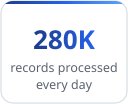
  
  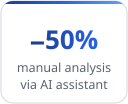

<h2 align="center">🧠 What I Build</h2>

  
  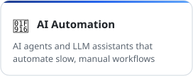
  
  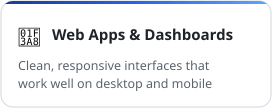
  
  

<h2 align="center">🛠️ Tech Stack</h2>

<table align="center">
  <tr>
    <td><b>Languages</b></td>
    <td>
      
      
      
    </td>
  </tr>
  <tr>
    <td><b>Backend</b></td>
    <td>
      
      
      
      
    </td>
  </tr>
  <tr>
    <td><b>Frontend</b></td>
    <td>
      
      
      
      
      
    </td>
  </tr>
  <tr>
    <td><b>Databases</b></td>
    <td>
      
      
      
    </td>
  </tr>
  <tr>
    <td><b>Cloud & DevOps</b></td>
    <td>
      
      
      
      
      
    </td>
  </tr>
  <tr>
    <td><b>Monitoring</b></td>
    <td>
      
      
    </td>
  </tr>
  <tr>
    <td><b>Also</b></td>
    <td>
      
      
      
      
       
      
      
      
      
    </td>
  </tr>
</table>

<h2 align="center">💼 Experience</h2>

  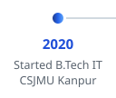

### 🏢 Namekart · Software Development Engineer
Jul 2024 – Present · Noida 
I own the company's domain-name platform end to end: **30+ modules** for finding, acquiring, pricing and selling domains. I write and review production code across the stack.

<table>
  <tr>
    <td>
      <b>🤖&nbsp; AI SEO Automation Platform</b> 
      Automates the whole SEO consulting process: site audits, keyword research, content briefs and rank tracking. Clients get scheduled reports on Telegram, and failed steps retry on their own. 
      <code>AI agents</code> <code>Temporal</code> <code>Microservices</code> <code>Telegram bot</code>
    </td>
  </tr>
  <tr>
    <td>
      <b>💬&nbsp; AI Assistant for Business Data</b> 
      Teams ask questions in plain English and get instant reports from platform data, limited to what their role allows. <b>Cut manual analysis by 50%.</b> 
      <code>LLM</code> <code>RAG</code> <code>Role-based access</code>
    </td>
  </tr>
  <tr>
    <td>
      <b>📈&nbsp; Domain-Intelligence Service</b> 
      Imports <b>280K records every day</b> and searches across <b>4M records in 15–30 ms</b>, with one-click CSV export of any result set. 
      <code>Spring Boot</code> <code>PostgreSQL</code> <code>Partitioning</code> <code>Indexing</code>
    </td>
  </tr>
  <tr>
    <td>
      <b>🧑‍💼&nbsp; HR Portal</b> 
      Attendance, leave, work logs and stipend calculation in one place, with location-based check-in for offices in several cities. <b>Cut manual HR work by 70%.</b> 
      <code>Full-stack</code> <code>Automation</code> <code>Multi-city</code>
    </td>
  </tr>
</table>

### 🚚 Rydeu Logistics · Backend Developer Intern
Nov 2023 – Jun 2024 · Remote

  
  
  
  
  

<h2 align="center">🚀 Featured Projects</h2>

Side projects I designed and built end to end. Click a title to see the code.

<table>
  <tr>
    <td>
      <h3>🏠 <a href="https://github.com/sanjeev662/ToLet-RoomOnRent">ToLet: Room on Rent</a></h3>
      Find rooms, flats and hotels to rent. Search on a map, save favourites, book, and chat live with the owner, who can list and manage their properties.
      

        
        
        
        
        &nbsp;·&nbsp;
        
        
      

    </td>
  </tr>
  <tr>
    <td>
      <h3>🎟️ <a href="https://github.com/sanjeev662/events-booking-system">Event Ticketing</a></h3>
      Ticket booking for a real event. People register, pay online and instantly get a QR-code PDF ticket, and organisers get an admin panel with Excel export.
      

        
        
        
        
        &nbsp;·&nbsp;
        
      

    </td>
  </tr>
  <tr>
    <td>
      <h3>🤖 <a href="https://github.com/sanjeev662/job-scrapper">Job Scrapper Agent</a></h3>
      Finds fresh LinkedIn jobs on a schedule, uses Gemini AI to match them against my resume and emails me a shortlist. Built-in limits keep it safe and low-frequency.
      

        
        
        
        
        &nbsp;·&nbsp;
        
      

    </td>
  </tr>
  <tr>
    <td>
      <h3>🛂 <a href="https://github.com/sanjeev662/visitor-management-system-react">Visitor Management</a></h3>
      Front-desk system for offices: register visitors with a photo, print RFID passes and track visits on dashboards, with separate access for admins, receptionists and guards.
      

        
        
        
        &nbsp;·&nbsp;
        
        
        
      

    </td>
  </tr>
  <tr>
    <td>
      <h3>💌 <a href="https://github.com/sanjeev662/wedding-invitation">Wedding Invitation</a></h3>
      An animated digital wedding invite. Guests swipe through ceremony cards, see a live countdown and the venue map, and get rich link previews when it's shared.
      

        
        
        
        
        &nbsp;·&nbsp;
        
        
      

    </td>
  </tr>
  <tr>
    <td>
      <h3>📖 <a href="https://github.com/sanjeev662/flipbook-app">PDF Flipbook</a></h3>
      Turns any PDF into a realistic page-turning book in the browser. It loads instantly, works on mobile, and every page has its own shareable link.
      

        
        
        
        &nbsp;·&nbsp;
        
        
      

    </td>
  </tr>
</table>

<b>More projects</b>

 

| Project | Highlights | Links |
| :-- | :-- | :-- |
| **Route Finder** | Suggests walking or running routes for a chosen distance using Google Maps (React + Node.js) | [Live](https://route-finder-application.vercel.app) · [Code](https://github.com/sanjeev662/Route-Finder-Application) |
| **Portfolio** | My personal site with projects, experience and contact | [Live](https://portfolio-sanjeev-singh.vercel.app/) · [Code](https://github.com/sanjeev662/PortfolioSanjeevSingh) |

<h2 align="center">🏆 Achievements</h2>

  
  <a href="https://github.com/sanjeev662/problem-solving">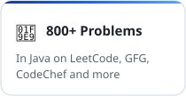</a>
  

  
  
  
  

 

  <b>Let's build something reliable.</b> 
  Open to conversations about backend systems, distributed workflows and AI-powered products.

